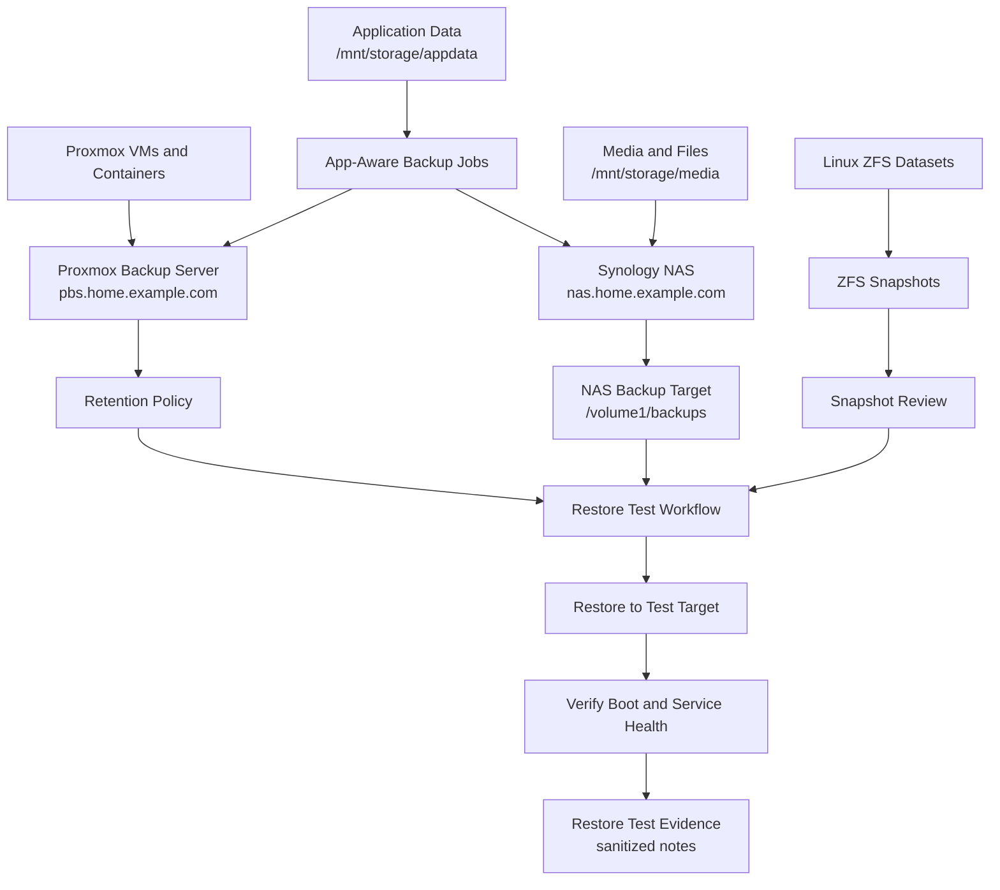

# Backup Flow Diagram

This diagram shows the public-safe backup and restore model for virtual machines, app data, NAS storage, ZFS snapshots, and restore verification.

## Diagram

## How to Read This

Backups are split by what they protect. Proxmox Backup Server protects VM and container recovery. NAS storage can hold files and selected backup targets. ZFS snapshots provide rollback points for datasets. App-aware jobs cover data that may not be consistent from a VM backup alone.

The important final step is restore verification. A backup is only useful if the restore path has been tested and documented.

## Public-Safe Notes

- Paths such as `/mnt/storage/appdata`, `/mnt/storage/media`, and `/volume1/backups` are generic examples.
- The diagram does not include real dataset names, backup encryption details, raw NAS exports, or backup logs.
- Restore evidence should be sanitized before it is added to the public repo.
