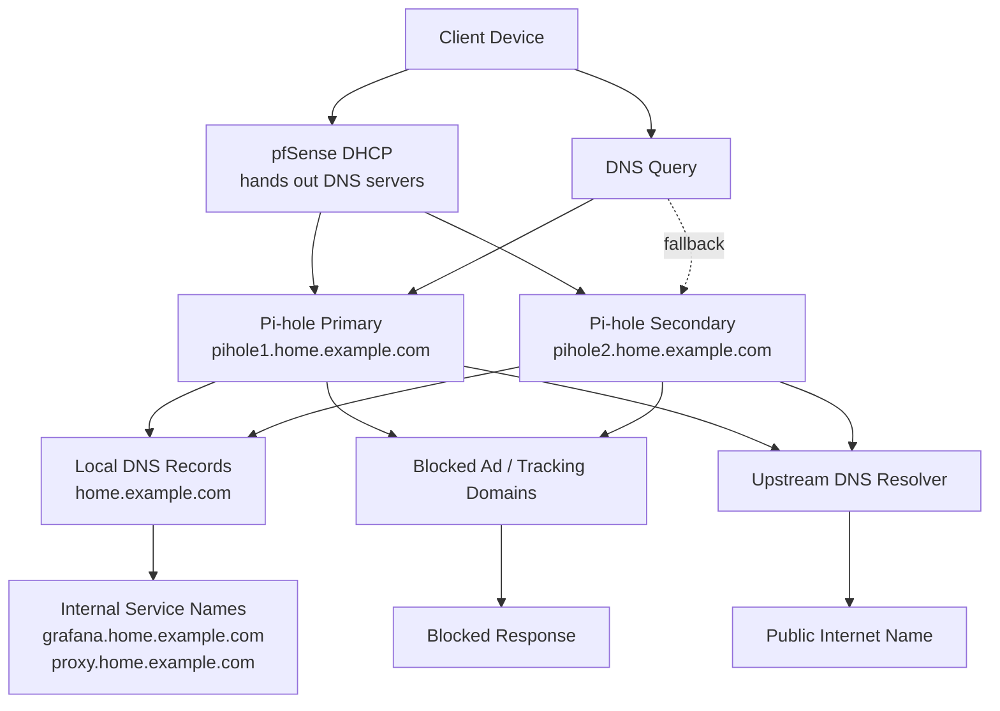

# DNS Flow Diagram

This diagram shows how client devices use pfSense DHCP, Pi-hole, local DNS records, and upstream resolvers in the KeepItTechie homelab.

## Diagram

## How to Read This

Client devices receive DNS settings from pfSense through DHCP. Instead of each device choosing a random public DNS resolver, the clients ask Pi-hole first. Pi-hole can answer local service names, block unwanted domains, or forward normal internet lookups upstream.

Internal DNS helps viewers avoid memorizing addresses. A service name such as `grafana.home.example.com` is easier to understand, document, and troubleshoot than a raw host address.

## Public-Safe Notes

- The DNS zone is represented with `home.example.com`, not a live private domain.
- The diagram does not include full zone files, exact host addresses, DHCP reservations, or private resolver settings.
- Primary and secondary Pi-hole names are sanitized examples.
