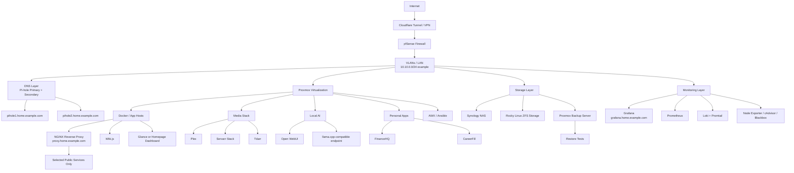

# Homelab Overview Diagram

This diagram is a public-safe architecture placeholder for the KeepItTechie homelab. It shows service roles and traffic flow without exposing real public domains, real public IPs, private credentials, or raw exports.

## Reading The Diagram

- Internet access is treated as controlled and intentional.
- pfSense remains the network policy point.
- Pi-hole provides internal DNS and filtering.
- Proxmox hosts most lab workloads.
- Storage, monitoring, media, AI, and personal apps are separated by role.
- Public access is limited to selected services, not admin tools.

## Public-Safe Notes

- Example DNS names use `home.example.com`.
- Example network references use `10.10.0.0/24`.
- Exact live hostnames, public domains, public IPs, and private credentials are intentionally omitted.
