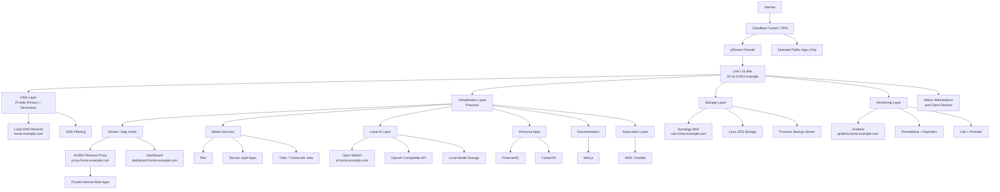

# Homelab Overview Diagram

This diagram shows the public-safe high-level architecture of the KeepItTechie homelab. It focuses on service roles and traffic flow without exposing real public domains, real public IP addresses, exact host addresses, credentials, or raw exports.

## Diagram

## How to Read This

Start at the top and follow traffic inward. Internet access reaches the lab only through controlled paths such as a tunnel or VPN. pfSense is the network policy point, Pi-hole handles internal DNS, and Proxmox hosts most workloads.

The lower layers show service categories rather than exact machine details. This keeps the diagram useful for learning while avoiding a public map of private infrastructure.

## Public-Safe Notes

- DNS names use examples such as `home.example.com`, `proxy.home.example.com`, and `grafana.home.example.com`.
- Network examples use `10.10.0.0/24` instead of exact host addresses.
- Real public domains, public IP addresses, account IDs, credentials, certificate paths, and production exports are intentionally omitted.
- Role labels are used when exact host identity does not help viewers understand the architecture.
