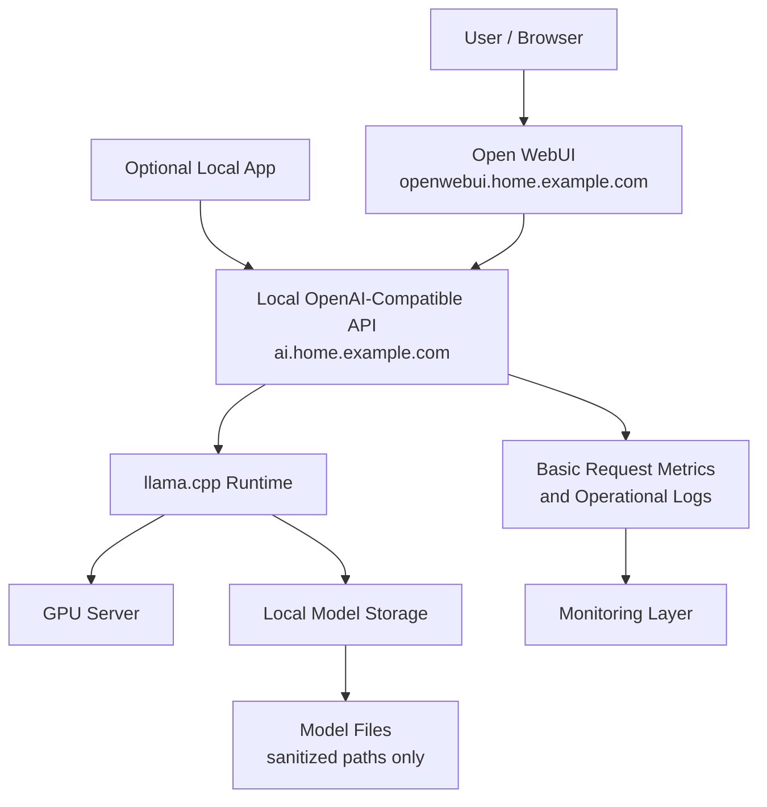

# Local AI Flow Diagram

This diagram shows the public-safe flow for a local AI stack using Open WebUI, an OpenAI-compatible local API endpoint, llama.cpp, model storage, and a GPU server.

## Diagram

## How to Read This

Users can interact with local models through Open WebUI, while local apps can call the same private API pattern. The API routes requests to llama.cpp, which loads local model files and uses GPU resources where available.

This pattern is useful for privacy, control, Linux learning, and experimenting with app integrations without depending on a public AI service for every request.

## Public-Safe Notes

- `ai.home.example.com` and `openwebui.home.example.com` are sanitized examples.
- Real model paths, prompts with private context, API credentials, and hardware serial details are intentionally omitted.
- Local AI endpoints should not be exposed publicly without strong authentication and a clear access policy.
