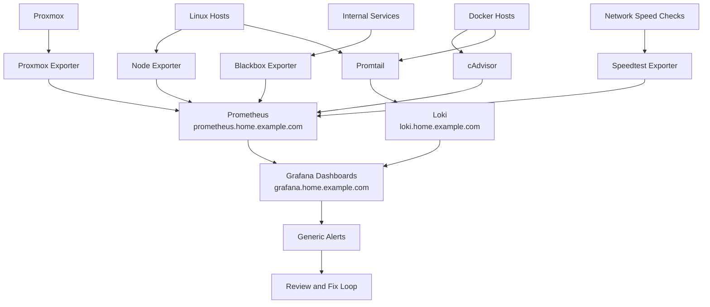

# Monitoring Flow Diagram

This diagram shows how metrics, logs, service checks, dashboards, and review loops fit together in the KeepItTechie homelab monitoring stack.

## Diagram

## How to Read This

Exporters collect metrics from hosts, containers, Proxmox, service checks, and network tests. Prometheus stores metrics. Promtail ships logs to Loki. Grafana brings metrics and logs together into dashboards.

The goal is not to monitor everything on day one. Start with simple host health, storage, service uptime, and backup visibility, then add dashboards as the lab grows.

## Public-Safe Notes

- Service names use sanitized examples such as `grafana.home.example.com`, `prometheus.home.example.com`, and `loki.home.example.com`.
- The diagram does not include private alert destinations, real dashboard screenshots, or raw log output.
- Alerts are shown generically so the repo does not expose private operations details.
