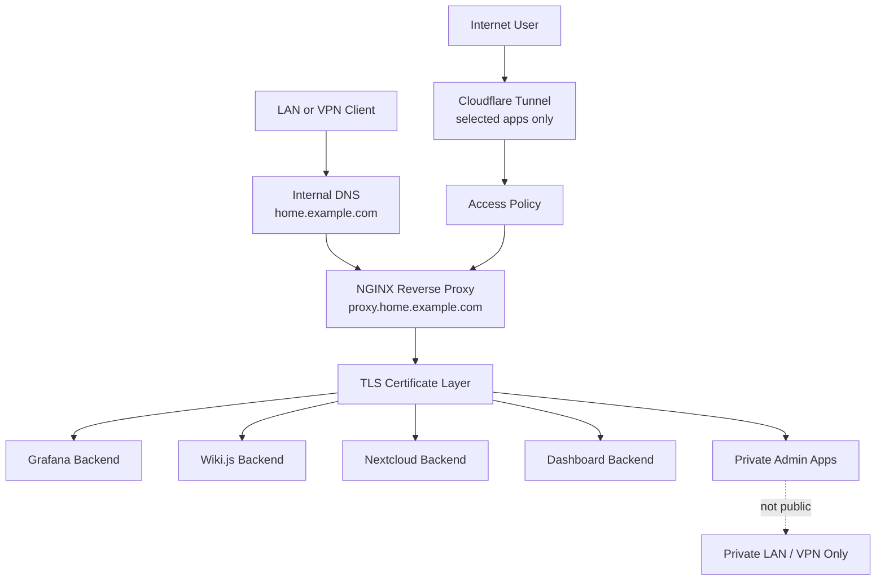

# Reverse Proxy Flow Diagram

This diagram shows the difference between private internal reverse proxy access and selected public access through a tunnel.

## Diagram

## How to Read This

Internal users resolve service names through internal DNS and reach the reverse proxy directly on the private network. The proxy handles clean HTTPS names and routes requests to the right backend.

Public access is separate. Only selected apps should be reachable through the tunnel, and those apps should still have appropriate authentication and access policy. Admin dashboards, backup systems, hypervisors, and automation controllers should remain private.

## Public-Safe Notes

- The diagram uses role names instead of exact backend addresses.
- `proxy.home.example.com` and `home.example.com` are sanitized examples.
- Real certificate paths, private certificate material, tunnel identifiers, and production routing rules are intentionally omitted.
